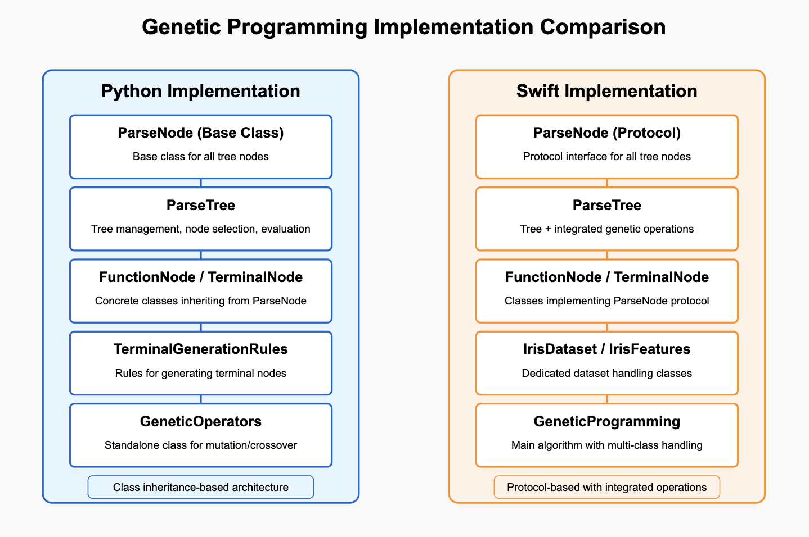

# Genetic Programming

Final project for Advanced Algorithms, exploring genetic programming

## Solving YOUR Problem / How It Works

### Multi-Language Implementation Comparison

In order to understand the impact programming language choice has on GP implementation and performance, we created parallel versions in Python and Swift. This allowed us to quantitatively measure execution speed differences between an interpreted language (Python) and a compiled language (Swift), while exploring each language's different solution architecture. Python offers dynamic typing and an extensive library ecosystem, for rapid development and testing, while Swift has a strong typing, value semantics, and protocol-oriented design, which despite being harder to implement, delivers a more “safe” development environment.

This comparative implementation made clear how Swift's protocols versus Python's class inheritance led to slightly different approaches for handling genetic operations. The high-level structure of each implementation can be seen below:

Some of the key implementations made in the Swift version were enabling polymorphic behavior between `FunctionNode` and `TerminalNode`. Another important point was the development of a custom `copy()` methods to handle proper tree duplication during the genetic operations. The methods are:

- For `TerminalNode`, creating a new node with the same value
- For `FunctionNode`, recursively copying each child node first, then creating a new function node with those copies
- For `ParseTree`, copying the root node and creating a new tree with it

The Swift implementation also tackles the multi-class Iris classification challenge using a "one-vs-all" approach. Rather than evolving a single expression tree to differentiate between all three species simultaneously, the system trains separate classifier trees for each Iris species (setosa, versicolor, and virginica). Each tree is evolved to output a high confidence value when presented with its target class and a low value otherwise. During classification, all three trees evaluate the same input features, generating confidence scores that indicate how strongly each classifier believes the sample belongs to its respective class. The final classification is determined by selecting the class corresponding to the tree that produced the highest confidence score, effectively letting the classifiers "vote" on the most likely species. This approach simplifies the evolutionary process by transforming a complex three-way classification problem into three more manageable binary classification tasks.
